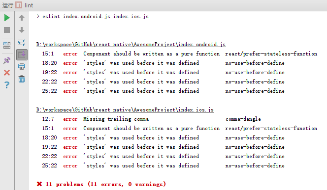
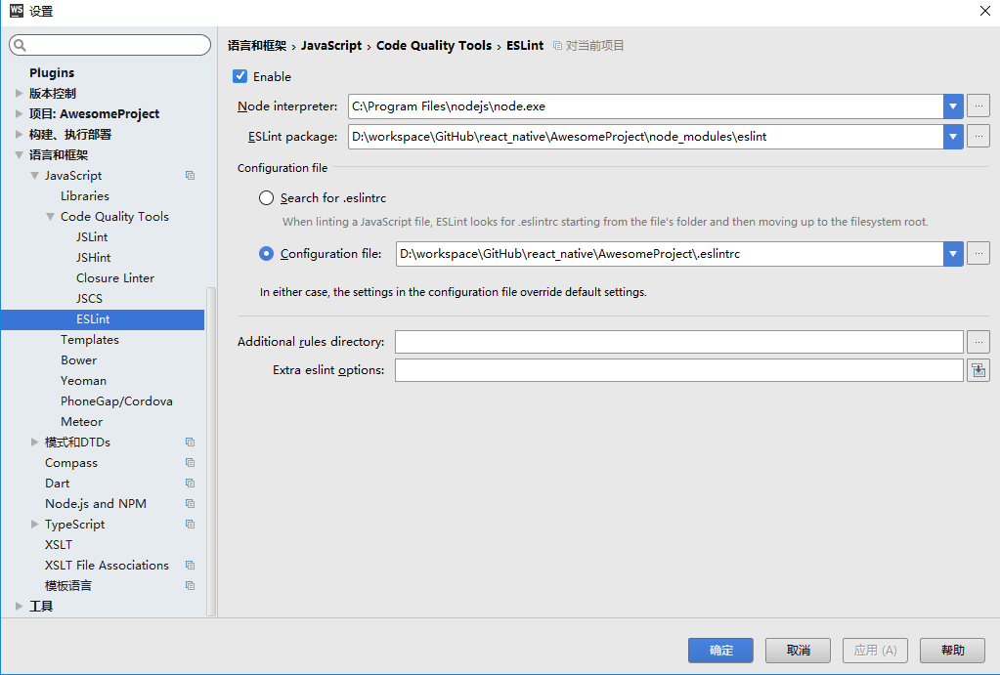
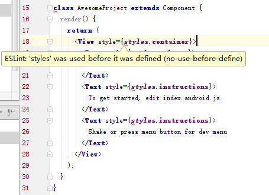
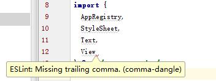
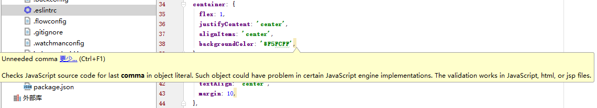
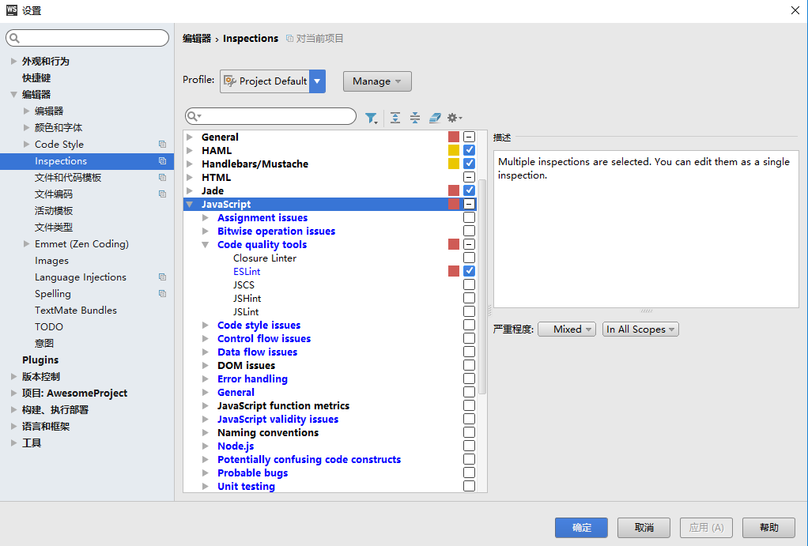
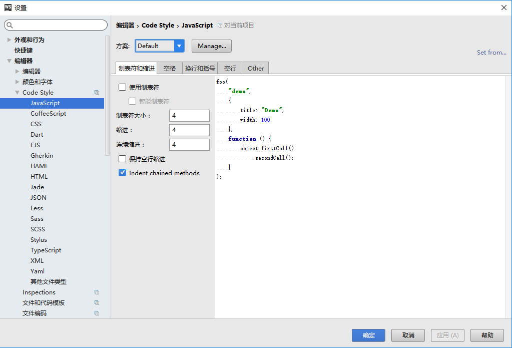

# 编码规范
虽然说代码风格没有好坏之分，只要始终坚持同一种风格就行。但是在团队协作的时候，不能只顾着坚持自己的风格，团队成员应该遵守相同的代编码规范。当然这首先需要一份团队成员都认可的编码规范。

在javascript的世界里，Airbnb维护的编码规范是比较流行的，用来作为团队的编码规范是不错的选择。  
[airbnb编码规范](https://github.com/airbnb/javascript)  
其中包括了es5，es6，react的代码规范，github上也有翻译后的中文版  
[es6编码规范](https://github.com/yuche/javascript)  
[react编码规范](https://github.com/JasonBoy/javascript/tree/master/react)

# 检查工具
如何在检查自己写的代码是否符合编码规范呢，可以使用eslint工具。  
1. 安装eslint
```npm install eslint --save-dev```  
2.安装es6+react规则集和配置
```npm install eslint-plugin-import eslint-plugin-react eslint-plugin-jsx-a11y eslint-config-airbnb --save-dev```  
3.在工程跟目录下面添加eslint配置文件.eslintrc
```
{
  "extends": "airbnb"
}
```  
4.在package.json中添加脚本调用eslint，并指定要检查的文件或文件夹，多个文件或文件夹之间用空格分开
```
"scripts": {
    "start": "node node_modules/react-native/local-cli/cli.js start",
    "lint": "eslint index.android.js index.ios.js"
  }
```  
然后执行npm run lint即可。  


# eslint与webstorm集成
除了直接调用命令行执行eslint外，还可以使用webstorm来集成eslint。一般来讲，在编码过程中比较适合通过webstorm来执行eslint，因为这样会得到即时提示。在准备提交代码之前，使用命令行跑一遍eslint检查一下是个好习惯，另外在发布之前，也可以用命令行执行eslint做最后的检查。

打开“菜单->设置->语言和框架->javascript->代码质量工具->eslint”  
  
然后webstorm中就能看到eslint的检查提示  


**注意：webstorm自带的检查可能会与eslint检查冲突，建议关闭webstorm自带的检查。**  
比如对象和数组的最后一项在airbnb的编码规则中是要求加上逗号的。但是如果加上逗号以后，webstorm自带的检查又会提示说最后一项不应该加逗号。  
  


打开“菜单->设置->编辑器->inspections”  
  
首先将javascript整个勾全部去掉，然后单独选中下面的eslint，如果觉得需要某些检查项，可以按照需求勾选。

# webstorm代码格式化
airbnb编码规则中有些关于格式的规则可以使用webstorm的代码格式化配置来解决，只要重新格式化一下代码就能直接符合编码规则，比如：
* 16.1  使用大括号包裹所有的多行代码块。
* 16.2  如果通过  if  和  else  使用多行代码块，把  else  放在  if  代码块关闭括号的同一行。
* 18.1  使用 2 个空格作为缩进。
* 18.2  在花括号前放一个空格。
* 18.3  在控制语句（ if 、 while  等）的小括号前放一个空格。在函数调用及声明中，不在函数的参数列表前加空格。
* 18.4  使用空格把运算符隔开。  

打开“菜单->设置->编辑器->代码风格->javascript”  

